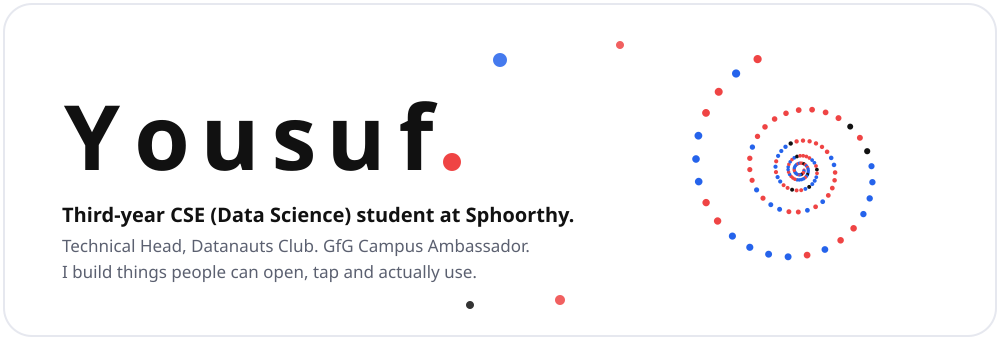
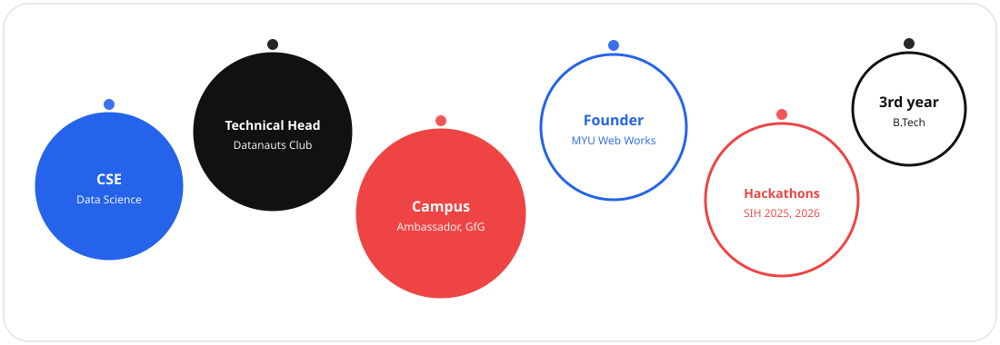
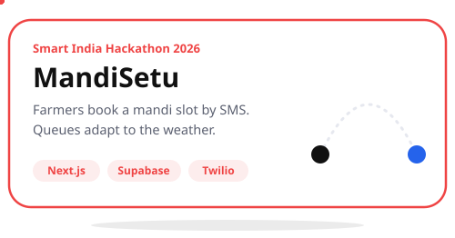
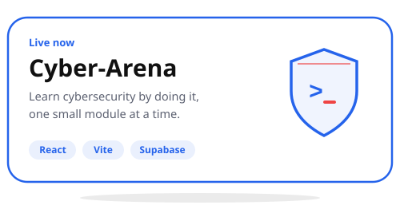
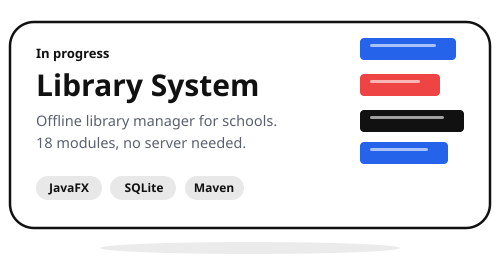
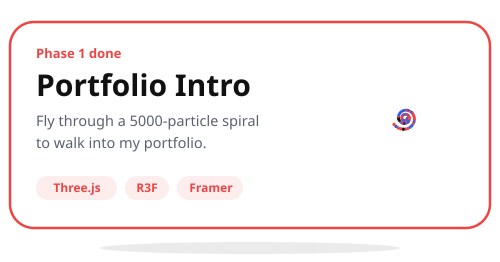
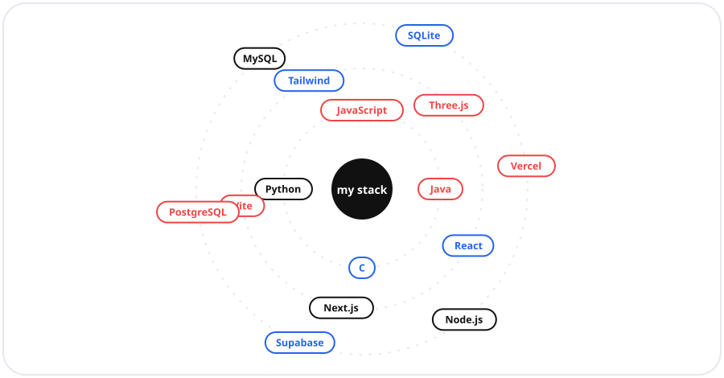

<h1 align="center">
   Hey, I'm Yousuf
</h1>

  

## Who's floating around me

  

## Things I'm shipping

<table align="center">
  <tr>
    <td align="center"></td>
    <td align="center"></td>
  </tr>
  <tr>
    <td align="center"></td>
    <td align="center"></td>
  </tr>
</table>

## Tools I keep close

  

## Say hi

  
  
  

  

